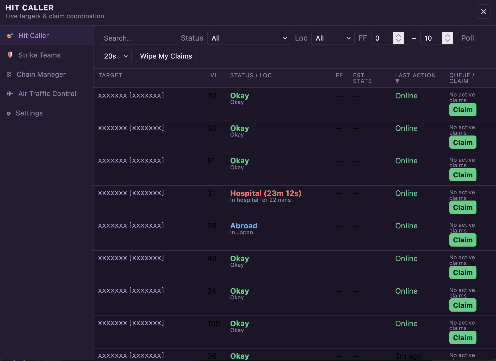
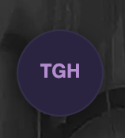
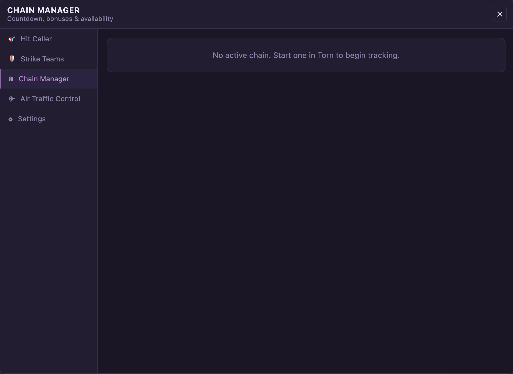
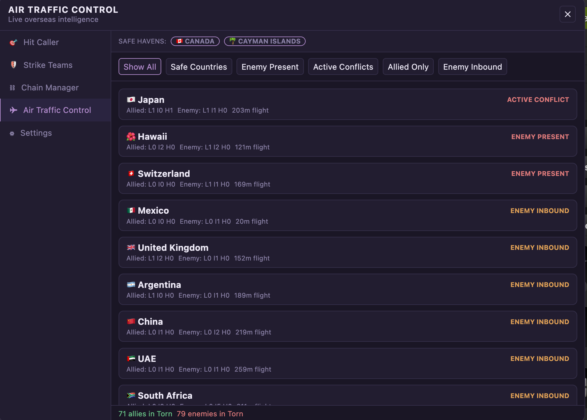
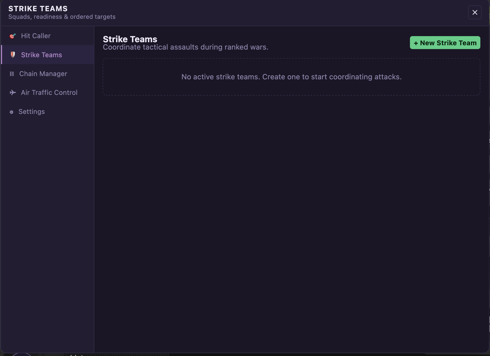
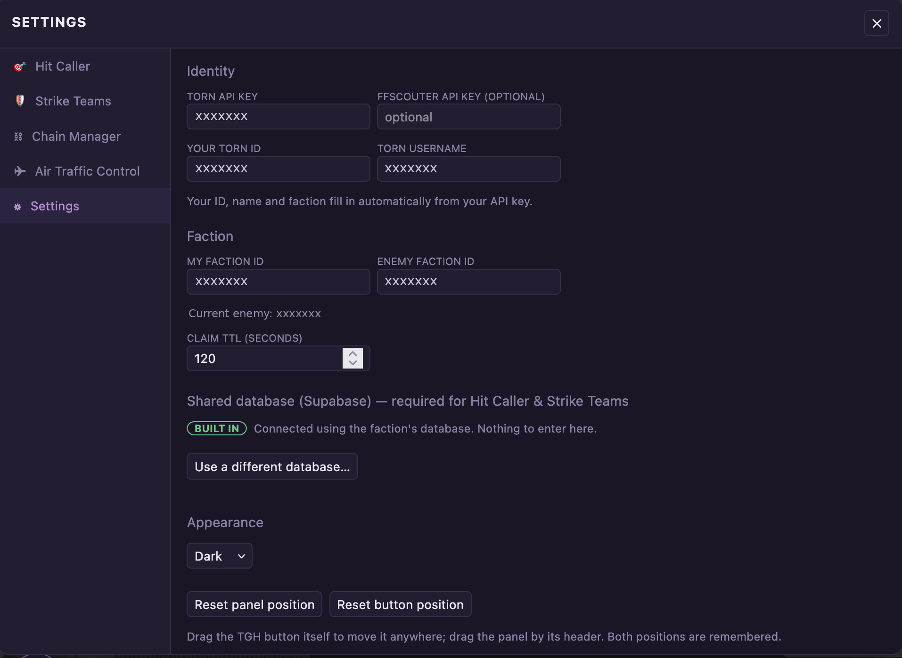

# The Green House

A faction war-room for [Torn City](https://www.torn.com), as a single userscript. Four coordination tools live in one floating panel that sits on top of any Torn page — no separate site to keep open in another tab.

Works with **Tampermonkey** and **Greasemonkey**.

<p align="center">
  
</p>

---

## The tools

A round **TGH** button sits in the bottom-left corner of every Torn page. Click it and the panel opens, with the four tools plus Settings down the left-hand side.

<p align="center">
  
</p>

### 🎯 Hit Caller

The live enemy roster during a war — every target with their status, hospital countdown, level, fair-fight rating and estimated stats.

The point of it is claiming. Press **Claim** and the rest of the faction sees the target is taken; if someone beat you to it you get a queue position instead. Claims expire on a timer so nothing stays locked forever, **Wipe My Claims** drops all of yours at once, and you get an audible alert when a target you claimed comes out of hospital.

Search by name or ID, filter by status or location, narrow by fair-fight range, and click any column header to sort. The poll interval is adjustable if you want it refreshing faster during a push.


*(Fair-fight and estimated stats show as `—` unless you add an FFScouter key — everything else works without one.)*

### ⛓ Chain Manager

The chain timer, large and unmissable, turning red under a minute. Shows the next bonus milestone and how many hits away it is, plus a live availability board of who in the faction is actually around to hit — ready, idle, offline, hospitalised or travelling.



*(Shown with no chain running. Start one in Torn and this fills with the countdown, milestone track and availability board.)*

### ✈ Air Traffic Control

Who's overseas, allied and enemy. Each country lists how many are **L**anded, **I**nbound or in **H**ospital on each side, tagged by whether it's an active conflict, enemy-held, enemy-inbound or clear — sorted so the contested places float to the top. The **safe havens** strip tells you at a glance where you can fly without landing on the enemy, and the footer counts everyone still in Torn.

Tap any country to expand it and see exactly who is there. Filters along the top narrow to safe countries, active conflicts, enemy present, and so on.



### 🛡 Strike Teams

Build a squad for a coordinated push. Add members, track who's marked themselves ready, and keep an ordered target list you work down together, ticking targets off as they fall and reordering as things change. Mission status runs planning → recruiting → ready → countdown → in progress.



*(Shown before any team exists.)*

---

## Requirements

- **Tampermonkey** ([Chrome/Edge/Firefox/Safari](https://www.tampermonkey.net/)) or **Greasemonkey** ([Firefox](https://www.greasespot.net/))
- A **Torn API key** — a *limited access* key is enough. Create one under [Preferences → API Key](https://www.torn.com/preferences.php#tab=api).
- Optional: an **FFScouter API key**, only for the fair-fight and estimated-stat columns in Hit Caller.

---

## Install

1. Install Tampermonkey or Greasemonkey if you haven't already.
2. Open this link — your userscript manager will offer to install it:

   **https://raw.githubusercontent.com/Nanthia/The-GreenHouse-Script/main/thegreenhouse.user.js**

3. Reload any Torn page. The round **TGH** button appears in the bottom-left corner.
4. Click it and paste your Torn API key into the **Settings** tab.

That's it. Your Torn ID, name and faction fill themselves in from the key, and the enemy faction is detected automatically once a ranked war starts.

Updates arrive on their own — your userscript manager re-checks this repo periodically.

> If that link gives you a Varnish/503 error, that's a CDN hiccup on your route rather than a problem with the file. Open the file on GitHub and use the **Raw** button, or copy the contents into a new script in your userscript manager by hand — either way you still get auto-updates afterwards.

---

## Using it

- **Move it out of your way.** Drag the TGH button anywhere; drag the panel by its header bar. Both remember where you put them, and Settings has a reset for each.
- **Only the tool you're looking at refreshes**, and closing the panel stops all polling — it isn't quietly hammering the Torn API in the background.
- The panel reopens on whichever tool you used last.

---

## Settings

| Field | What it does |
|---|---|
| Torn API key | Required. Everything reads from this. Limited access is enough. |
| FFScouter API key | Optional. Adds fair-fight and estimated stats to Hit Caller. |
| Your Torn ID / Username | Fills in automatically from your API key. Claims are tagged with your real ID so the faction knows who claimed what. |
| My Faction ID | Fills in automatically. |
| Enemy Faction ID | Detected automatically during a ranked war. Type one in manually to scout a faction outside of war — a manual entry won't be overwritten. |
| Claim TTL | How long your claims last before expiring, in seconds. |
| Theme | Dark or light. |



**Chain Manager** and **Air Traffic Control** need nothing but your Torn API key. **Hit Caller** and **Strike Teams** additionally need the faction's shared database — if Settings shows a green **BUILT IN** badge, that's already sorted and there's nothing for you to enter.

---

## Your data

Your Torn API key is stored locally by your own userscript manager and is sent only to Torn's own API (`api.torn.com`). It never goes to the shared database, and nobody else in the faction can see it.

What *is* shared, when you claim a target or join a strike team, is your Torn ID, name and what you claimed — which is the entire point of the feature.

---

## Faction setup

*For whoever runs the faction's database. Members don't need any of this.*

Hit Caller and Strike Teams need a shared [Supabase](https://supabase.com) project (the free tier is fine). Two SQL scripts are included:

- **`new_project_setup.sql`** — for a fresh project. Creates every table, index, integrity rule and security policy in one pass. Edit one line at the top: your faction ID.
- **`rls_setup.sql`** — to lock down an existing project that already has the tables instead.

Then paste the project URL and publishable (anon) key into the `BAKED_IN` block at the top of `thegreenhouse.user.js`, so members configure nothing but their own Torn API key.

**Run the SQL before publishing the key.** The key is designed to be publishable, but only once row-level security is switched on; the SQL is what makes it safe to ship. Either value can be base64'd with a `b64:` prefix to keep automated key scrapers off it.

---

## Troubleshooting

**No TGH button.** Check the script is enabled in your userscript manager and reload the Torn page. It's bottom-left by default — if you dragged it somewhere odd, use Settings → Reset button position.

**"No Torn API key set."** Open Settings and paste your key. If it was rejected, confirm it's still active under Preferences → API Key in Torn.

**Hit Caller says no enemy faction.** Normal outside a war. It fills in automatically when a ranked war starts, or type an enemy faction ID into Settings to scout one manually.

**Claims aren't syncing with the rest of the faction.** Everyone needs the same database. If Settings shows the Supabase fields rather than a BUILT IN badge, check with whoever set the project up. A red banner across the top of Hit Caller means the database is unreachable — claim info shown while that banner is up may be incomplete, so don't trust it mid-war.

**Fair-fight and estimated stats are blank.** Those need an FFScouter API key in Settings.

---

## Development

```bash
npm install
npm test
```

`smoketest.cjs` drives the whole UI in a simulated browser against mocked Torn, FFScouter and Supabase responses. `sqltest.cjs` runs the database schema against a real Postgres and asserts the security rules hold — that claims can't be deleted, reassigned, backdated or written for another faction.

Screenshots in this README have had player names, IDs, API keys and faction identifiers redacted with `redact.py`.

Version 2.3.2
